# Informe Concu — Sistema de Alquiler de Bicicletas

| Nombre del integrante            | Padrón  |
|-------------------|---------|
| Emiliano Gomez    | 110042  |
| Guido Mazzucco    | 111310  |
| Javier Menechian  | 107942  |

En el siguiente informe se describen las entidades, mensajes y decisiones de diseño que conforman el sistema distribuido para el alquiler y devolución automatizado de bicicletas en una ciudad. El sistema está implementado en Rust utilizando Actix como framework de actores y Tokio como runtime asincrónico.
 
Las aplicaciones principales del sistema son:

- App `Cliente`

- App `Sede`

- App `ProcesadorPagos`

Además, se describen entidades de soporte que viajan como datos dentro de los mensajes del sistema, como `Bici`, `BiciAlquilada`, `SedeInfo` y otros tipos internos utilizados por las Sedes para persistir y reconstruir su estado local.

## Arquitectura de Aplicaciones Distribuidas
El sistema está compuesto por varias aplicaciones independientes. Cada `Cliente`, cada `Sede` y cada `ProcesadorPagos` corre como un proceso separado. La comunicación entre estas aplicaciones no se realiza mediante `Addr<T>`, ya que las direcciones de actores solo son válidas dentro de un mismo proceso. Para la comunicación entre procesos se utilizan conexiones TCP y mensajes serializados.

La única excepción son los `Slot`: cada Sede administra internamente sus slots como actores Actix. Esto permite que la estación mantenga encapsulado el estado de cada espacio físico sin compartir memoria mutable entre ellos. La comunicación entre la Sede y sus Slots sí se realiza mediante `Addr<Slot>`, porque viven dentro de la misma aplicación.

La separación queda definida de la siguiente forma:

- App `Cliente`
    - Maneja la interacción del usuario.
    - Mantiene una caché local de sedes conocidas.
    - Se comunica con las Sedes por TCP.

- App `Sede`
    - Gestiona alquileres, devoluciones, conectividad con otras sedes y sincronización.
    - Contiene internamente actores Slot.
    - Se comunica con Clientes, otras Sedes y ProcesadoresPagos por TCP.

- Actor `Slot`
    - Vive únicamente dentro de una App Sede.
    - Representa un espacio físico de la estación.
    - Se comunica con su Sede mediante `Addr<Slot>`.

- App `ProcesadorPagos`
    - Corre como proceso independiente.
    - Recibe pedidos de pre-autorización y cobro desde las Sedes.
    - Se comunica con las Sedes por TCP.

 
## Modelo de Concurrencia
El sistema no utiliza Actix como modelo global de todas las entidades, sino como herramienta interna dentro de cada Sede. Cada aplicación es responsable de su propio estado y se comunica con las demás mediante mensajes serializados enviados por `TCP`.

Dentro de la App Sede, los `Slot` son actores Actix. Cada Slot procesa sus mensajes de a uno, por lo que su estado interno no requiere locks explícitos. Esto resulta útil para operaciones como reservar una bicicleta, confirmar una entrega, cancelar una reserva o asegurar una devolución.

Existen dos mecanismos de comunicación según el límite que se esté cruzando:

- Comunicación local dentro de una Sede: se realiza con `Addr<Slot>`, `send().await` o `do_send`, dependiendo de si la Sede necesita esperar una respuesta.

- Comunicación remota entre aplicaciones: se realiza mediante `TCP` y mensajes serializados. En este caso no se envían actores ni direcciones de actores, sino datos que representan la operación solicitada.

Por ejemplo, cuando un `Cliente` solicita una bicicleta, la App `Cliente` envía un mensaje de red a una App `Sede`. Luego, dentro de esa `Sede`, la aplicación puede comunicarse localmente con un actor `Slot` para intentar reservar una bicicleta disponible.

ClienteApp -- TCP --> SedeApp --`Addr<Slot>` --> Slot

Esta separación permite cumplir con la distribución real del sistema: cada entidad principal corre como aplicación independiente, pero la estación conserva un modelo interno de actores para sus slots.

### Protocolo de aplicación

La comunicación remota entre aplicaciones se realiza sobre TCP utilizando mensajes serializados en JSON.

Se eligió JSON porque simplifica la implementación, facilita el debugging durante la simulación y permite inspeccionar los mensajes enviados entre procesos sin herramientas adicionales. Cada mensaje incluye un campo que identifica el tipo de operación y un payload con los datos necesarios.

Las direcciones `Addr<T>` de Actix no se serializan ni se envían por red. Cuando una aplicación necesita comunicarse con otra, utiliza su dirección TCP (`SocketAddr`) y envía un mensaje JSON.

## Diagrama de arquitectura del sistema

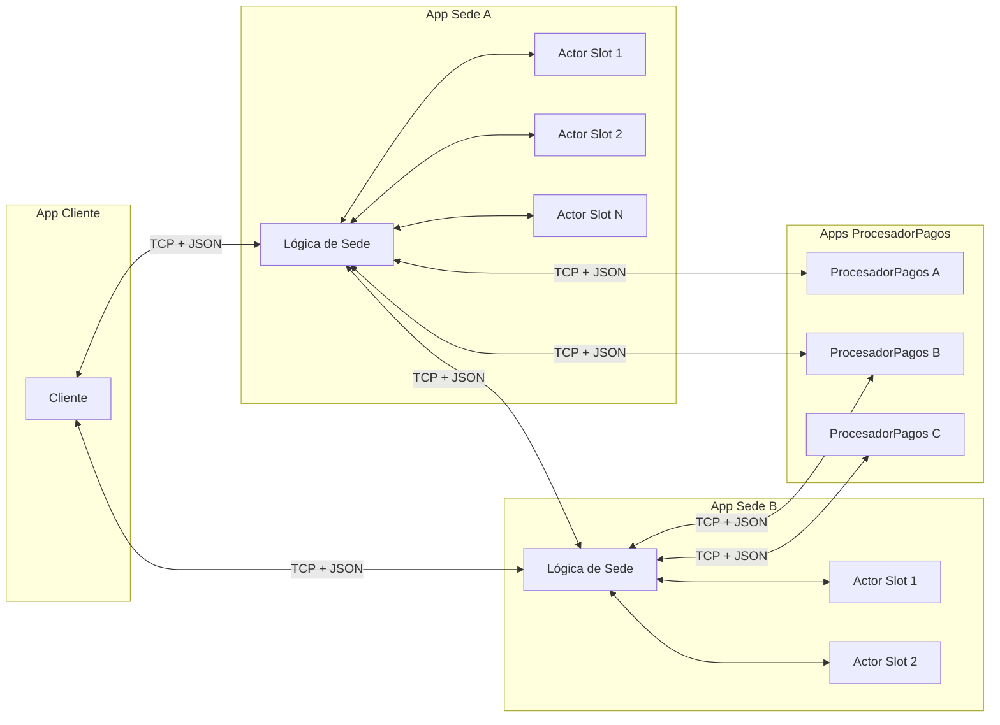
```mermaid
flowchart LR
    subgraph ClienteApp["App Cliente"]
        C["Cliente"]
    end

    subgraph SedeApp1["App Sede A"]
        S1["Lógica de Sede"]
        SL1["Actor Slot 1"]
        SL2["Actor Slot 2"]
        SLN["Actor Slot N"]

        S1 <--> SL1
        S1 <--> SL2
        S1 <--> SLN
    end

    subgraph SedeApp2["App Sede B"]
        S2["Lógica de Sede"]
        SLB1["Actor Slot 1"]
        SLB2["Actor Slot 2"]

        S2 <--> SLB1
        S2 <--> SLB2
    end

    subgraph PagosApp["Apps ProcesadorPagos"]
        P1["ProcesadorPagos A"]
        P2["ProcesadorPagos B"]
        P3["ProcesadorPagos C"]
    end

    C <-->|TCP + JSON| S1
    C <-->|TCP + JSON| S2
    S1 <-->|TCP + JSON| S2
    S1 <-->|TCP + JSON| P1
    S1 <-->|TCP + JSON| P2
    S2 <-->|TCP + JSON| P2
    S2 <-->|TCP + JSON| P3
``` 

## Bici
 
`Bici` es una estructura de datos, no un actor. Representa a la bicicleta física y viaja como payload dentro de los mensajes del sistema. Su identificador único permite que las estaciones la reconozcan al momento de asegurarla o liberarla.
 
```rs
pub struct Bici {
    bici_id: String,
}
```
 
---
 
## Slot

`Slot` es el único componente del sistema modelado como actor interno de una Sede. No corre como aplicación independiente ni expone una conexión TCP propia. Su ciclo de vida está administrado por la App Sede que lo contiene.

Cada Sede tiene entre 10 y 20 slots. Al ser un actor, su estado es gestionado de forma concurrente y segura dentro del modelo de actores. La Sede se comunica con sus Slots mediante `Addr<Slot>`, porque ambos viven dentro del mismo proceso.

```rs
pub struct Slot {
    slot_id: u32,
    estado: EstadoSlot,
}
```

El Slot no conoce una `Addr<Sede>` ni se comunica directamente con otras aplicaciones. La coordinación de la operación completa queda en manos de la App Sede, que consulta o modifica el estado de sus Slots enviándoles mensajes locales.

### EstadoSlot

```rs
pub enum EstadoSlot {
    Vacio,
    Reservado { bici_id: String },
    Disponible { bici_id: String },
}
```

Los tres estados describen la relación del slot con la bicicleta que alberga. Un slot `Vacio` no tiene bicicleta y puede recibir una devolución. Un slot `Disponible` tiene una bicicleta lista para ser alquilada. El estado `Reservado` es transitorio y se activa durante la saga de alquiler: el slot tiene una bicicleta pero está siendo procesada para entregarse a un cliente. Guarda el `bici_id` para poder volver al estado `Disponible` en caso de que la saga deba hacer rollback.

### Mensajes que recibe

```rs
pub enum MsgSedeASlot {
    Reservar,
    Confirmar,
    Cancelar,
    AsegurarBici { bici_id: String },
    Consultar,
}
```

* **Reservar**: Intenta llevar el slot del estado `Disponible` al estado `Reservado`. Si el slot no está en estado `Disponible`, rechaza la operación. Se envía con `send().await` ya que la Sede necesita saber si la reserva fue exitosa antes de continuar con la saga.
* **Confirmar**: Transiciona el slot de `Reservado` a `Vacio`, indicando que la bicicleta fue entregada al cliente y el slot quedó libre para recibir devoluciones. Se envía con `send().await` como parte de la confirmación final de la saga.
* **Cancelar**: Transiciona el slot de `Reservado` a `Disponible`, restaurando el `bici_id` que el estado `Reservado` preservaba. Es el mecanismo de rollback dentro de la saga de alquiler cuando algún paso posterior falla.
* **AsegurarBici**: Transiciona el slot de `Vacio` a `Disponible`, registrando la bicicleta devuelta por el cliente. Se envía con `send().await` durante el flujo de devolución para confirmar que el slot puede recibir la bici.
* **Consultar**: Devuelve el estado actual del slot. Se usa para que la Sede pueda construir su información de disponibilidad.
 
## Cliente
 
El Cliente es una aplicación independiente que representa la app móvil del usuario. Se comunica con las Sedes a través de conexiones TCP. 

Mantiene una caché local de sedes conocidas que le permite operar en modo offline cuando no hay conectividad.
 
```rs
pub struct Cliente {
    cliente_id: String,
    coords: (f64, f64),
    bici_activa: Option<BiciAlquilada>,
    sedes_cacheadas: Vec<SedeInfo>,
}

pub struct BiciAlquilada {
    bici_id: String,
    alquiler_id: String,
    cliente_id: String,
    sede_origen_id: u32,
    inicio_ts: u64,
    token_alquiler: String,
}
```

El campo `bici_activa` almacena la bicicleta que el cliente tiene alquilada en un momento dado. A diferencia de la bicicleta física, `BiciAlquilada` también guarda el `alquiler_id`, el `cliente_id`, la `sede_origen_id` y el `inicio_ts`.

Estos datos funcionan como un comprobante mínimo del alquiler activo: el Cliente no interpreta la lógica del alquiler ni calcula montos, pero conserva la información necesaria para que cualquier Sede pueda procesar una devolución.

El campo `cliente_id` permite asociar el cobro con el usuario correspondiente. El campo `inicio_ts` permite que la Sede destino calcule la duración del alquiler y el monto proporcional al tiempo de uso sin depender de un registro global centralizado de alquileres activos.

Esto permite que una bicicleta pueda ser devuelta en una Sede distinta a la de origen sin depender de un registro global centralizado de alquileres activos.

### Mensajes que envía

```rs
pub enum MsgClienteASede {
    SolicitarBici { cliente_id: String, coords: (f64, f64) },
    AckComprobanteAlquiler { alquiler_id: String },
    DevolverBici  { bici: BiciAlquilada, coords: (f64, f64) },
    PedirSedes    { coords: (f64, f64) },
}
```

#### DevolverBici

El cliente envía este mensaje cuando desea devolver la bicicleta que tiene alquilada. Lo puede enviar a cualquier Sede con espacio disponible, no necesariamente a la de origen. El mensaje incluye la información mínima del alquiler activo para que la Sede destino pueda identificar la bicicleta, calcular el cobro y notificar a la Sede origen que el alquiler fue cerrado.

#### PedirSedes

El cliente envía este mensaje para obtener información actualizada sobre las sedes del sistema: coordenadas, disponibilidad de slots y estado de conectividad. La Sede responde con la información que conoce de sí misma y de las sedes vecinas registradas en su `sedes_conocidas`.

No existe una Sede central para resolver este pedido. Todas las Sedes son pares: cada una responde con la información que conoce localmente y con la información que fue recibiendo mediante heartbeats de sedes cercanas. Por eso la respuesta puede ser eventualmente consistente. El campo `ultimo_update_ts` de cada `SedeInfo` permite saber qué tan reciente es cada dato.

Este mensaje implementa un mecanismo de caché con fallback: si el cliente no recibe respuesta dentro de un tiempo de espera definido, usa su `sedes_cacheadas` local como respaldo. Esto garantiza que la funcionalidad de visualización de sedes opere incluso sin conectividad.

### Mensajes que recibe

#### ComprobanteAlquilerEmitido

Respuesta intermedia durante `SolicitarBici`. La Sede envía una `BiciAlquilada` con `token_alquiler` antes de liberar físicamente la bicicleta.

El Cliente guarda este comprobante de forma temporal y responde `AckComprobanteAlquiler { alquiler_id }`. La Sede no confirma el Slot hasta recibir este ack, porque necesita asegurarse de que el Cliente ya tiene el comprobante firmado necesario para una futura devolución.

```rs
ComprobanteAlquilerEmitido { bici: BiciAlquilada }
```

#### AlquilerConfirmado

Respuesta exitosa final a `SolicitarBici`. Indica que la bicicleta fue asignada, el comprobante firmado ya fue entregado al Cliente y el slot fue confirmado. A partir de este mensaje, el Cliente guarda definitivamente la `BiciAlquilada` en `bici_activa` y luego la reenvía al momento de devolverla.

```rs
AlquilerConfirmado { bici: BiciAlquilada }
```

#### AlquilerRechazado

Respuesta fallida a `SolicitarBici`. Indica el motivo por el cual no fue posible realizar el alquiler, por ejemplo falta de disponibilidad o fallo en la pre-autorización de pago.

```rs
AlquilerRechazado { motivo: String }
```

#### DevolucionOk

Respuesta exitosa a `DevolverBici`. Incluye la duración del alquiler y el monto cobrado proporcional al tiempo de uso.

```rs
DevolucionOk { monto: f64, duracion_min: u64 }
```

#### DevolucionRechazada

Respuesta fallida a `DevolverBici`. Indica que la Sede no pudo recibir la bicicleta, por ejemplo porque no tiene slots vacíos, porque el Cliente está fuera del radio permitido o porque el `token_alquiler` es inválido.

```rs
DevolucionRechazada { motivo: String }
```

#### RespuestaSedes

Respuesta a `PedirSedes`. Contiene la información de todas las sedes que la Sede contactada conoce, incluyendo las propagadas mediante heartbeats de sedes vecinas.

```rs
RespuestaSedes { sedes: Vec<SedeInfo> }
```
 
---
 
## Sede

La `Sede` es una aplicación independiente del sistema. Representa una estación física con capacidad para entre 10 y 20 bicicletas. Gestiona sus slots, procesa alquileres, recibe devoluciones, mantiene información parcial sobre sedes vecinas y puede operar tanto conectada como desconectada.

Cada Sede es responsable de persistir localmente la parte del estado que le corresponde. No existe un registro global centralizado de alquileres activos. En particular:

* La Sede origen guarda los alquileres que se iniciaron en ella y siguen activos.
* La Sede destino guarda las devoluciones que recibió.
* Si una bicicleta se devuelve en una Sede distinta a la de origen, la Sede destino notifica a la Sede origen para que cierre el alquiler.
* El `ProcesadorPagos` registra pagos, pero no conoce la lógica interna de los alquileres.

No existe una sede central ni elección de líder entre Sedes. Todas las Sedes tienen el mismo rol y se coordinan de forma directa mediante mensajes entre pares. La información de disponibilidad y conectividad se propaga por heartbeats, mientras que los alquileres y devoluciones se concilian entre la Sede origen y la Sede destino involucradas.

```rs
pub struct Sede {
    sede_id: u32,
    coords: (f64, f64),
    slots: Vec<Addr<Slot>>,
    alquileres_activos: Vec<AlquilerActivo>,
    devoluciones_recibidas: Vec<DevolucionRecibida>,
    pagos_pendientes: Vec<PagoPendiente>,
    notificaciones_pendientes: Vec<NotificacionPendiente>,
    log_local: Vec<EventoSede>,
    estado_red: EstadoRed,
    sedes_conocidas: Vec<SedeInfo>,
    nodos_pago: Vec<SocketAddr>,
    procesador_pagos_lider: Option<SocketAddr>,
}
```

El campo `slots` contiene las direcciones de los actores `Slot`, que son internos a la aplicación de Sede. En cambio, `nodos_pago` contiene direcciones de red de procesos `ProcesadorPagos`, por lo que la comunicación con pagos no usa `Addr<T>` sino TCP. El campo `procesador_pagos_lider` guarda el nodo de pagos que actualmente actúa como coordinador elegido por Bully. Si ese líder no responde, la Sede puede reintentar contra otro nodo conocido para que los procesadores ejecuten una nueva elección.

El campo `alquileres_activos` contiene los alquileres que fueron iniciados en esta Sede y todavía no fueron cerrados. Si una bicicleta sale desde la Sede A, entonces la Sede A es la responsable de recordar que ese alquiler está activo.

El campo `devoluciones_recibidas` contiene las devoluciones que esta Sede recibió. Si la bicicleta había salido desde otra Sede, esta devolución queda pendiente de conciliación hasta que se notifique correctamente a la Sede origen.

El campo `pagos_pendientes` almacena cobros que todavía no pudieron confirmarse contra un `ProcesadorPagos`, por ejemplo porque todos los nodos de pago conocidos estaban caídos o no respondieron a tiempo.

El campo `notificaciones_pendientes` almacena mensajes que deben enviarse a otras sedes cuando vuelva la conectividad. El caso principal es notificar a la Sede origen que una bicicleta fue devuelta en esta Sede.

El campo `log_local` persiste los eventos relevantes de la Sede, incluyendo snapshots del estado actual de todos sus slots. No funciona como historial global del sistema, sino como mecanismo de recuperación local: si la Sede se cae y vuelve a iniciar, puede reconstruir sus slots, alquileres activos, devoluciones recibidas, pagos pendientes y notificaciones pendientes desde este log.

### Sedes pares y descubrimiento por heartbeats

Todas las Sedes son equivalentes: ninguna coordina ni centraliza a las demás. Cada Sede mantiene su propio estado local, su lista de `sedes_conocidas` y una vista eventualmente consistente de la disponibilidad del resto.

La comunicación entre Sedes se usa solo para los casos necesarios: propagar información de disponibilidad mediante `Heartbeat`, notificar devoluciones a la Sede origen y confirmar esas notificaciones con `AckDevolucion`.

Cada Sede sigue siendo responsable de persistir localmente los alquileres que originó y las devoluciones que recibió. Si una bicicleta se devuelve en una Sede distinta a la de origen, la Sede destino notifica directamente a la Sede origen para que esta cierre el alquiler activo correspondiente.

La caída de una Sede no altera el funcionamiento. Las otras Sedes simplemente continúan operando con su estado local y con la última información recibida por heartbeats. Cuando la Sede caída vuelve, retoma el envío de heartbeats y reintenta sus pagos o notificaciones pendientes.

### EstadoRed

```rs
pub enum EstadoRed {
    Conectado,
    Desconectado { desde_ts: u64 },
}
```

El `estado_red` determina el comportamiento de la Sede ante solicitudes entrantes y ante la necesidad de comunicarse con otros procesos. Una Sede desconectada puede seguir operando localmente con sus slots, persistiendo los eventos que no pueda conciliar en el momento.

### Estado local de alquileres y devoluciones

```rs
pub struct AlquilerActivo {
    alquiler_id: String,
    bici_id: String,
    cliente_id: String,
    sede_origen_id: u32,
    inicio_ts: u64,
    pago_preautorizacion_id: String,
    deadline_devolucion_ts: u64,
    estado: EstadoAlquiler,
    pago_multa_id: Option<String>,
    reembolso_multa_id: Option<String>,
}

pub enum EstadoAlquiler {
    Activo,
    Sospechoso,
    Cerrado,
    RoboConfirmado,
    RoboRevertido,
}

pub struct DevolucionRecibida {
    alquiler_id: String,
    bici_id: String,
    cliente_id: String,
    sede_origen_id: u32,
    sede_destino_id: u32,
    fin_ts: u64,
    monto: f64,
    pago_id: Option<String>,
    estado_pago: EstadoConciliacion,
    estado_notificacion_origen: EstadoConciliacion,
}

pub struct PagoPendiente {
    payment_request_id: String,
    alquiler_id: String,
    cliente_id: String,
    monto: f64,
    tipo: TipoPagoPendiente,
    intentos: u8,
}

pub enum TipoPagoPendiente {
    PreAutorizacion,
    CobroFinal,
    MultaRobo,
    ReembolsoPenalizacion,
}

pub struct NotificacionPendiente {
    alquiler_id: String,
    bici_id: String,
    cliente_id: String,
    sede_origen_id: u32,
    sede_destino_id: u32,
    fin_ts: u64,
    monto: f64,
    pago_id: Option<String>,
    intentos: u8,
}

pub enum EstadoConciliacion {
    Pendiente,
    Confirmado,
    Fallido,
}
```

`AlquilerActivo` representa un alquiler iniciado en esta Sede que todavía no fue cerrado. Cuando la bicicleta se devuelve en la misma Sede, puede cerrarse localmente. Si se devuelve en otra Sede, se cierra cuando llega una notificación desde la Sede destino.

El campo `deadline_devolucion_ts` representa el tiempo máximo que la Sede origen espera para recibir una devolución. La Sede origen no hace un pull activo ni consulta a todas las sedes para preguntar si vieron la bicicleta. Si pasado ese tiempo no recibió `NotificarDevolucion`, marca el alquiler como sospechoso y luego como robo confirmado según la política definida por la simulación.

El campo `estado` permite distinguir si el alquiler sigue normalmente activo, si pasó a estar bajo sospecha por exceso de tiempo, si ya fue cerrado, si terminó marcado como robo confirmado o si ese robo fue revertido porque más tarde llegó una notificación válida de devolución.

Los campos `pago_multa_id` y `reembolso_multa_id` permiten reconstruir qué pasó con la penalización por robo. Si el alquiler se marca como `RoboConfirmado`, la Sede origen cobra una multa al Cliente mediante el `ProcesadorPagos`. Si después aparece una devolución válida enviada tarde por la Sede destino, la Sede origen revierte el estado a `RoboRevertido` y solicita el reembolso de esa penalización.

`DevolucionRecibida` representa una bicicleta que fue devuelta en esta Sede. Puede quedar pendiente de conciliación con el `ProcesadorPagos`, con la Sede origen, o con ambos.

`PagoPendiente` representa una operación de pago que debe reintentarse. Se utiliza cuando una devolución, una multa por robo o un reembolso no pudieron confirmarse por problemas de conectividad con los nodos de pago.

`NotificacionPendiente` representa una notificación hacia la Sede origen que todavía no pudo enviarse o confirmarse. Esto cubre el caso donde una Sede recibe una bicicleta y se cae o pierde conectividad antes de avisarle a la Sede que originó el alquiler.

### Log local

```rs
pub enum EventoSede {
    EstadoSlotsActualizado {
        slots: Vec<SlotPersistido>,
    },
    TokenAlquilerEmitido {
        alquiler_id: String,
        bici_id: String,
        cliente_id: String,
        sede_origen_id: u32,
        inicio_ts: u64,
    },
    AlquilerIniciado {
        alquiler_id: String,
        bici_id: String,
        cliente_id: String,
        inicio_ts: u64,
    },
    AlquilerReconstruidoDesdeToken {
        alquiler_id: String,
        bici_id: String,
        cliente_id: String,
        sede_origen_id: u32,
        inicio_ts: u64,
    },
    AlquilerMarcadoSospechoso {
        alquiler_id: String,
        bici_id: String,
        cliente_id: String,
        desde_ts: u64,
    },
    DeadlineDevolucionVencido {
        alquiler_id: String,
        bici_id: String,
        cliente_id: String,
        ts: u64,
    },
    DevolucionRecibida {
        alquiler_id: String,
        bici_id: String,
        cliente_id: String,
        sede_origen_id: u32,
        sede_destino_id: u32,
        fin_ts: u64,
        monto: f64,
    },
    PagoPendienteRegistrado {
        payment_request_id: String,
        alquiler_id: String,
        cliente_id: String,
        monto: f64,
    },
    PagoConfirmado {
        alquiler_id: String,
        payment_request_id: String,
        pago_id: String,
    },
    NotificacionOrigenPendiente {
        alquiler_id: String,
        bici_id: String,
        cliente_id: String,
        sede_origen_id: u32,
        sede_destino_id: u32,
        fin_ts: u64,
        monto: f64,
        pago_id: Option<String>,
    },
    NotificacionOrigenConfirmada {
        alquiler_id: String,
        sede_origen_id: u32,
    },
    AlquilerCerrado {
        alquiler_id: String,
        fin_ts: u64,
        monto: f64,
    },
    RoboConfirmado {
        alquiler_id: String,
        bici_id: String,
        cliente_id: String,
        ts: u64,
        monto_multa: f64,
    },
    MultaRoboCobrada {
        alquiler_id: String,
        payment_request_id: String,
        pago_id: String,
        monto_multa: f64,
    },
    RoboRevertidoPorDevolucionTardia {
        alquiler_id: String,
        bici_id: String,
        sede_destino_id: u32,
        fin_ts: u64,
    },
    ReembolsoPenalizacionConfirmado {
        alquiler_id: String,
        payment_request_id: String,
        pago_id: String,
        monto_reembolsado: f64,
    },
}

pub struct SlotPersistido {
    slot_id: u32,
    estado: EstadoSlotPersistido,
}

pub enum EstadoSlotPersistido {
    Vacio,
    Disponible { bici_id: String },
    Reservado { bici_id: String, alquiler_id: String },
}
```

El `log_local` persiste los eventos relevantes de la Sede para poder recuperar su estado luego de una caída. A diferencia de un historial global del sistema, este log es local a cada Sede y solamente representa los hechos que esa Sede necesita recordar.

Además de guardar eventos de negocio, el log guarda snapshots del estado actual de todos los slots mediante `EstadoSlotsActualizado`. Cada vez que una operación modifica el estado físico de la estación —por ejemplo reservar una bicicleta, cancelar una reserva, confirmar un retiro o asegurar una devolución— la Sede agrega al log una nueva imagen completa de sus slots.

Como cada Sede tiene entre 10 y 20 slots, persistir el estado completo de los slots ante cada cambio no representa una carga significativa y simplifica la recuperación. De esta forma no hace falta reconstruir el estado físico aplicando evento por evento desde el inicio, sino que alcanza con tomar el último `EstadoSlotsActualizado`.

Al reiniciar, la Sede reconstruye su estado local de la siguiente manera:

1. Lee su `log_local`.
2. Busca el último evento `EstadoSlotsActualizado`.
3. Reconstruye los actores `Slot` a partir de ese snapshot.
4. Reconstruye sus alquileres activos, devoluciones recibidas, pagos pendientes y notificaciones pendientes a partir del resto de los eventos del log.

Los campos `slots_vacios` y `slots_disponibles` de `SedeInfo` no se persisten como fuente de verdad. Se calculan a partir del último estado conocido de los slots. Esto evita inconsistencias entre una cantidad guardada y el estado real de cada slot.

El estado `Reservado` representa una reserva en curso dentro de una saga de alquiler. Si la Sede se cae mientras un slot estaba reservado, al reiniciar puede detectar esa saga incompleta y decidir si continuarla o compensarla, por ejemplo cancelando la reserva y volviendo el slot a `Disponible`.

### Operación Offline

Una Sede puede perder conectividad con el resto del sistema en cualquier momento. En ese caso, continúa operando localmente con la información que tiene disponible: puede alquilar bicicletas propias, recibir devoluciones en slots vacíos y persistir los eventos correspondientes en su `log_local`.

No se intenta sincronizar cada operación contra una Sede central, porque no existe una Sede líder. Toda operación que no pueda completarse por falta de conectividad se guarda localmente en una de las estructuras pendientes de la Sede:

```rs
pagos_pendientes: Vec<PagoPendiente>,
notificaciones_pendientes: Vec<NotificacionPendiente>,
```

`pagos_pendientes` contiene cobros, multas o reembolsos que todavía no pudieron confirmarse contra el servicio de `ProcesadorPagos`.

`notificaciones_pendientes` contiene devoluciones recibidas por esta Sede que todavía no pudieron ser informadas a la Sede donde se originó el alquiler.

Cuando la Sede recupera conectividad simplemente vuelve a enviar heartbeats a sus sedes conocidas y procesa sus pendientes locales:

1. Reintenta los pagos pendientes contra el líder actual del cluster de `ProcesadorPagos` o contra otro nodo de pagos conocido.
2. Si el pago fue confirmado, actualiza la devolución recibida con el `pago_id`.
3. Reintenta las notificaciones pendientes hacia las sedes origen correspondientes.
4. Cuando la Sede origen confirma la notificación, la Sede destino marca la devolución como conciliada.

Este enfoque permite que el sistema funcione con consistencia eventual: durante una partición puede haber sedes con información parcial, pero al recuperar conectividad los estados se reconcilian mediante mensajes pendientes persistidos localmente.

### Mensajes que envía

```rs
pub enum MsgSedeACliente {
    ComprobanteAlquilerEmitido { bici: BiciAlquilada },
    AlquilerConfirmado { bici: BiciAlquilada },
    AlquilerRechazado  { motivo: String },
    DevolucionOk       { monto: f64, duracion_min: u64 },
    DevolucionRechazada{ motivo: String },
    RespuestaSedes     { sedes: Vec<SedeInfo> },
}
```

```rs
pub enum MsgSedeASlot {
    Reservar,
    Confirmar,
    Cancelar,
    AsegurarBici { bici_id: String },
    Consultar,
}
```

```rs
pub enum MsgSedeAProcesadorPagos {
    PreAutorizarPago {
        payment_request_id: String,
        cliente_id: String,
        monto_seguridad: f64,
    },
    CobrarPago {
        payment_request_id: String,
        alquiler_id: String,
        cliente_id: String,
        monto_final: f64,
    },
    ReembolsarPago {
        payment_request_id: String,
        alquiler_id: String,
        cliente_id: String,
        pago_original_id: String,
        monto_reembolso: f64,
    },
}
```

```rs
pub enum MsgSedeASede {
    Heartbeat {
        sede_id: u32,
        info: SedeInfo,
    },
    NotificarDevolucion {
        alquiler_id: String,
        bici_id: String,
        cliente_id: String,
        sede_origen_id: u32,
        sede_destino_id: u32,
        fin_ts: u64,
        monto: f64,
        pago_id: Option<String>,
        token_alquiler: String,
    },
    AckDevolucion {
        alquiler_id: String,
        sede_origen_id: u32,
        sede_destino_id: u32,
    },
}
```

#### Heartbeat

La Sede envía periódicamente un `Heartbeat` a las sedes que se encuentran dentro de un radio fijo definido por el sistema. El envío se realiza sin esperar una respuesta, ya que no requiere confirmación. El payload incluye la información actualizada de la propia Sede.

Las sedes receptoras actualizan su `sedes_conocidas` con los datos recibidos. Esta información es eventualmente consistente y no representa un registro global de alquileres.

Cuando un cliente solicita `PedirSedes`, la Sede responde con la información que conoce localmente en `sedes_conocidas`, incluyendo la propia.

Si una Sede deja de recibir heartbeats de otra durante cierto tiempo, puede marcarla como no conectada dentro de `sedes_conocidas`.

#### NotificarDevolucion y AckDevolucion

`NotificarDevolucion` es enviado por la Sede destino a la Sede origen cuando una bicicleta se devuelve en una estación distinta a la que inició el alquiler.

El mensaje incluye los datos de la devolución y también el `token_alquiler` que viajaba dentro de la `BiciAlquilada`. Esto permite que la Sede origen pueda validar el comprobante incluso si no encuentra el alquiler en sus `alquileres_activos`.

Al recibir `NotificarDevolucion`, la Sede origen puede encontrarse con tres casos.

En el caso normal, encuentra el `alquiler_id` en sus `alquileres_activos` con estado `Activo` o `Sospechoso`. Entonces lo marca como cerrado, persiste `AlquilerCerrado` en su `log_local` y responde `AckDevolucion`.

En el caso borde, la Sede origen no encuentra el `alquiler_id`. Esto puede pasar si la Sede se cayó después de liberar físicamente la bicicleta pero antes de persistir `AlquilerIniciado`. En vez de rechazar la devolución, la Sede origen valida el `token_alquiler` usando el secreto compartido entre Sedes. Si el token es válido, reconstruye el alquiler mínimo a partir de los datos firmados, persiste `AlquilerReconstruidoDesdeToken`, luego persiste `AlquilerCerrado` y responde `AckDevolucion`.

En el caso tardío, la Sede origen ya había marcado el alquiler como `RoboConfirmado` porque venció el tiempo máximo y nunca recibió la notificación. Si más tarde llega `NotificarDevolucion` con un token válido, la Sede origen acepta que la bicicleta no fue realmente robada: persiste `RoboRevertidoPorDevolucionTardia`, cierra el alquiler, responde `AckDevolucion` y solicita al `ProcesadorPagos` un `ReembolsarPago` por la penalización cobrada.

Si el token es inválido, la Sede origen rechaza la conciliación porque no puede confiar en los datos recibidos.

Si la Sede destino no puede contactar a la Sede origen, guarda una `NotificacionPendiente` y la reintenta más tarde. Si la Sede destino se cae antes de notificar, al reiniciar reconstruye esa notificación pendiente desde su `log_local`.

Este protocolo evita mantener un registro global de alquileres activos y permite aceptar devoluciones aun cuando la Sede origen haya perdido el registro local del alquiler por una caída en medio de la saga. La Sede origen sigue siendo responsable de los alquileres que inició, pero el token firmado permite reconstruir un alquiler legítimo cuando sea necesario.

#### PreAutorizarPago, CobrarPago y ReembolsarPago

Son mensajes enviados por la Sede al líder actual de `ProcesadorPagos` mediante TCP. Ese líder es elegido por los propios nodos de pago usando Bully y actúa como coordinador de un commit de dos fases para que la operación quede replicada de forma consistente entre procesadores.

`PreAutorizarPago` se utiliza durante la saga de alquiler, antes de confirmar el slot y liberar la bicicleta. Si la pre-autorización falla, la Sede cancela la reserva del slot y rechaza el alquiler.

`CobrarPago` se utiliza al momento de procesar una devolución y también cuando la Sede origen confirma un robo y debe cobrar una penalización. La Sede genera un `payment_request_id` único para que el pedido sea idempotente. Si el líder de pagos no responde, la Sede puede reintentar el mismo pedido contra otro nodo de pagos usando el mismo `payment_request_id`.

`ReembolsarPago` se utiliza cuando una bicicleta marcada como robada aparece más tarde por una notificación válida de la Sede destino. En ese caso la Sede origen revierte el robo y solicita al `ProcesadorPagos` el reembolso de la penalización cobrada previamente.

Los mensajes se envían esperando respuesta, ya que el resultado del pago determina cómo continúa el flujo.

### Mensajes que recibe

Los mensajes que la Sede recibe de los clientes son los definidos en `MsgClienteASede`. Los mensajes que recibe desde otras sedes son los definidos en `MsgSedeASede`. Además, la Sede recibe respuestas desde los nodos `ProcesadorPagos` para saber si una pre-autorización o un cobro fue aceptado o rechazado.

---

## ProcesadorPagos

El `ProcesadorPagos` es una aplicación independiente encargada de simular la lógica de pagos del sistema. No vive dentro de una Sede ni se comunica mediante `Addr<T>`, sino que corre como un proceso separado al que las Sedes acceden por red.

El sistema puede tener varios nodos `ProcesadorPagos`. Entre ellos ejecutan el algoritmo Bully para elegir un líder de pagos. Ese líder no decide la lógica de alquileres, pero sí coordina las operaciones de pago que llegan desde las Sedes.

Cuando una Sede necesita pre-autorizar, cobrar, cobrar una multa por robo o reembolsar una penalización, envía el pedido al líder de pagos conocido. Si ese líder no responde, la Sede puede contactar a otro nodo de pagos. Ante la caída del líder, los nodos `ProcesadorPagos` ejecutan Bully y el nuevo líder se anuncia al resto.

El `Cliente` no se comunica directamente con el `ProcesadorPagos`. La Sede es quien tramita el pago: recibe la solicitud del Cliente, calcula cuándo corresponde pre-autorizar, cobrar o reembolsar, y luego delega esa operación en el líder de pagos.

El `ProcesadorPagos` no conoce la lógica de alquileres. No decide si un alquiler está activo, cerrado, robado o revertido. Únicamente recibe datos de una operación de pago, la persiste localmente y responde si fue aceptada o rechazada. El `alquiler_id`, si aparece en el mensaje, se trata como un identificador externo opaco usado para trazabilidad.

```rs
pub struct ProcesadorPagos {
    procesador_id: u32,
    addr: SocketAddr,
    peers: Vec<SocketAddr>,
    rol: RolProcesadorPagos,
    pagos_procesados: Vec<PagoProcesado>,
    transacciones_en_curso: Vec<TransaccionPago2PC>,
}

pub enum RolProcesadorPagos {
    Replica,
    Lider {
        epoch_lider: u64,
    },
}
```

El campo `pagos_procesados` mantiene el historial local de operaciones de pago procesadas por ese nodo. Este historial no reemplaza el estado de las Sedes: solamente representa operaciones de pago que el servicio de pagos aceptó o rechazó.

El campo `peers` contiene las direcciones de otros nodos `ProcesadorPagos` conocidos. Esto permite ejecutar Bully para elegir líder y 2PC para replicar una decisión de pago entre procesadores.

El campo `transacciones_en_curso` guarda operaciones que están atravesando el commit de dos fases. Si el líder se cae en la mitad, los nodos pueden reconstruir si una transacción estaba preparada, confirmada o abortada.

### Estado de soporte

```rs
pub struct PagoProcesado {
    payment_request_id: String,
    pago_id: String,
    alquiler_id: Option<String>,
    cliente_id: String,
    monto: f64,
    tipo: TipoOperacionPago,
    estado: EstadoPago,
}

pub enum TipoOperacionPago {
    PreAutorizacion,
    CobroFinal,
    MultaRobo,
    ReembolsoPenalizacion,
}

pub enum EstadoPago {
    PreAutorizado,
    Aceptado,
    Reembolsado,
    Rechazado,
}

pub struct TransaccionPago2PC {
    payment_request_id: String,
    operacion: TipoOperacionPago,
    participantes: Vec<u32>,
    votos_commit: Vec<u32>,
    votos_abort: Vec<u32>,
    estado: EstadoTransaccionPago,
}

pub enum EstadoTransaccionPago {
    Preparando,
    Preparada,
    Commit,
    Abort,
}
```

Para evitar cobros duplicados ante reintentos, cada operación de pago se identifica con un `payment_request_id` único generado por la Sede. Si el líder de pagos recibe nuevamente un pedido con el mismo `payment_request_id`, no vuelve a ejecutar el cobro: devuelve la misma respuesta que ya fue persistida.

`EstadoPago::PreAutorizado` indica que el cliente pasó la validación previa necesaria para poder retirar una bicicleta. `EstadoPago::Aceptado` indica que el cobro final o la multa fueron procesados correctamente. `EstadoPago::Reembolsado` indica que una penalización cobrada previamente fue devuelta. `EstadoPago::Rechazado` indica que la operación fue rechazada por la simulación del procesador.

### Mensajes que recibe desde Sede

```rs
pub enum MsgSedeAProcesadorPagos {
    PreAutorizarPago {
        payment_request_id: String,
        cliente_id: String,
        monto_seguridad: f64,
    },
    CobrarPago {
        payment_request_id: String,
        alquiler_id: String,
        cliente_id: String,
        monto_final: f64,
    },
    ReembolsarPago {
        payment_request_id: String,
        alquiler_id: String,
        cliente_id: String,
        pago_original_id: String,
        monto_reembolso: f64,
    },
}
```

`PreAutorizarPago`: Simula la pre-autorización de un monto de seguridad antes de liberar una bicicleta. Si la operación es aceptada, responde con `PagoPreAutorizado`. Si es rechazada, responde con `PagoRechazado`.

`CobrarPago`: Simula el cobro final de una devolución o el cobro de una multa por robo. Recibe el `alquiler_id`, el `cliente_id` y el monto calculado por la Sede. Si la operación es aceptada, responde con `PagoAceptado { pago_id }`. Si es rechazada, responde con `PagoRechazado`.

`ReembolsarPago`: Simula la devolución de una penalización cobrada previamente. Se usa cuando la Sede origen había marcado una bicicleta como robada, pero luego recibe una notificación tardía válida de la Sede destino. Si la operación es aceptada, responde con `PagoReembolsado { pago_id }`.

### Mensajes que envía a Sede

```rs
pub enum MsgProcesadorPagosASede {
    PagoPreAutorizado {
        payment_request_id: String,
        pago_id: String,
    },
    PagoAceptado {
        payment_request_id: String,
        pago_id: String,
    },
    PagoReembolsado {
        payment_request_id: String,
        pago_id: String,
    },
    PagoRechazado {
        payment_request_id: String,
        motivo: String,
    },
}
```

`PagoPreAutorizado`: Indica que el cliente puede continuar con el proceso de alquiler.

`PagoAceptado`: Indica que el cobro final o la multa por robo fueron realizados correctamente. Incluye un `pago_id` para que la Sede pueda asociar el pago con la devolución o con el robo confirmado.

`PagoReembolsado`: Indica que se devolvió una penalización cobrada previamente. La Sede origen persiste este resultado como `ReembolsoPenalizacionConfirmado`.

`PagoRechazado`: Indica que la operación fue rechazada. Durante el alquiler esto dispara el rollback del slot reservado. Durante la devolución, la multa o el reembolso, la Sede puede dejar la operación como pendiente si el evento de negocio ya ocurrió.

### Mensajes entre procesadores

```rs
pub enum MsgProcesadorAProcesador {
    EleccionPago {
        procesador_id: u32,
    },
    RespuestaEleccionPago {
        procesador_id: u32,
    },
    CoordinadorPago {
        lider_id: u32,
        epoch_lider: u64,
    },
    PrepararPago {
        payment_request_id: String,
        pago: PagoProcesado,
    },
    VotoPago {
        payment_request_id: String,
        voto: Voto2PC,
    },
    CommitPago {
        payment_request_id: String,
    },
    AbortPago {
        payment_request_id: String,
    },
    AckDecisionPago {
        payment_request_id: String,
    },
    ConsultarPago {
        payment_request_id: String,
    },
    RespuestaConsultaPago {
        pago: Option<PagoProcesado>,
    },
}

pub enum Voto2PC {
    Commit,
    Abort,
}
```

`EleccionPago`, `RespuestaEleccionPago` y `CoordinadorPago` pertenecen al algoritmo Bully utilizado para elegir el líder de pagos. El nodo con mayor prioridad que permanece vivo se anuncia como coordinador.

`PrepararPago`, `VotoPago`, `CommitPago`, `AbortPago` y `AckDecisionPago` implementan el commit de dos fases. El líder primero pregunta si los participantes pueden persistir la operación. Si todos responden `Commit`, el líder confirma la operación. Si alguno responde `Abort` o no responde dentro del timeout, el líder aborta la transacción.

`ConsultarPago` y `RespuestaConsultaPago` se usan para resolver reintentos idempotentes. Si un nodo recibe un pedido repetido o una Sede contacta a una replica por error, puede consultar el estado de esa operación y devolver la decisión ya tomada.

### Protocolo de comunicación

La comunicación entre una Sede y el servicio de pagos se realiza por TCP mediante mensajes serializados. La Sede intenta enviar el pedido al líder de pagos conocido. Si el líder no responde, contacta a otro procesador; ese procesador puede informar el líder actual o iniciar una nueva elección Bully si detecta que el coordinador cayó.

Cuando el líder recibe una operación nueva, primero verifica si ya existe un `PagoProcesado` con ese `payment_request_id`. Si existe, devuelve la respuesta persistida previamente y no vuelve a ejecutar la operación.

Si no existe, el líder inicia 2PC contra los demás procesadores. En la fase de prepare, cada participante valida si puede aceptar la operación y la deja registrada como preparada. En la fase de commit, si todos votaron afirmativamente, el líder confirma la operación y todos la persisten como definitiva. Si hay timeout o algún voto negativo, el líder envía abort y la Sede recibe `PagoRechazado` o deja la operación pendiente para reintentar.

Este protocolo permite tolerar timeouts, respuestas perdidas, reintentos contra distintos nodos y caída del líder de pagos sin duplicar cobros ni reembolsos.

---

## Saga de Alquiler

El proceso de alquiler involucra múltiples pasos que deben ejecutarse de forma coordinada. Si alguno falla antes de liberar la bicicleta, los pasos anteriores deben compensarse para no dejar el sistema en un estado inconsistente. Este patrón se conoce como Saga.

En este sistema no se intenta garantizar atomicidad estricta entre la liberación física de la bicicleta y la persistencia del alquiler activo. En cambio, se utiliza una estrategia de consistencia eventual basada en un comprobante firmado del alquiler.

Antes de liberar la bicicleta, la Sede origen genera una `BiciAlquilada` con un `token_alquiler`. Este token se calcula firmando los datos principales del alquiler con un secreto simétrico compartido entre las Sedes. En la simulación, este secreto puede estar hardcodeado en todas las aplicaciones Sede.

Conceptualmente:

```rs
token_alquiler = firmar_con_secreto_compartido(
    alquiler_id,
    bici_id,
    cliente_id,
    sede_origen_id,
    inicio_ts
)
```

El token no reemplaza al estado local de la Sede origen, pero permite que cualquier Sede pueda validar localmente que el comprobante fue emitido por una Sede válida y que sus datos no fueron modificados por el Cliente.

```rs
pub struct BiciAlquilada {
    bici_id: String,
    alquiler_id: String,
    cliente_id: String,
    sede_origen_id: u32,
    inicio_ts: u64,
    token_alquiler: String,
}
```

Los pasos y sus compensaciones son:

| Paso | Acción                                                                      | Compensación si falla el siguiente        |
| ---- | --------------------------------------------------------------------------- | ----------------------------------------- |
| 1    | Reservar Slot (`send().await`): `Disponible` → `Reservado`                  | Cancelar Slot: `Reservado` → `Disponible` |
| 2    | Pre-autorizar pago en `ProcesadorPagos` por TCP                             | Cancelar Slot: `Reservado` → `Disponible` |
| 3    | Generar `alquiler_id`, `inicio_ts` y `token_alquiler`                       | Cancelar Slot: `Reservado` → `Disponible` |
| 4    | Enviar `ComprobanteAlquilerEmitido` al Cliente                              | Cancelar Slot: `Reservado` → `Disponible` |
| 5    | Recibir `AckComprobanteAlquiler` del Cliente                                | Cancelar Slot: `Reservado` → `Disponible` |
| 6    | Confirmar Slot (`send().await`): `Reservado` → `Vacio`                      | —                                         |
| 7    | Registrar `AlquilerActivo` en la Sede origen y persistir `AlquilerIniciado` | —                                         |

Si el paso 1 falla, porque no hay slots en estado `Disponible`, se responde `AlquilerRechazado` directamente. Si el paso 2 falla, porque el pago fue rechazado o porque ningún nodo de pagos pudo pre-autorizar la operación, se envía `Cancelar` al Slot para volver al estado `Disponible`.

La parte importante de esta saga es que el Cliente recibe el comprobante firmado antes de que la bicicleta sea liberada físicamente. Si la Sede origen se cae luego de confirmar el Slot pero antes de persistir `AlquilerIniciado`, el Cliente ya conserva una `BiciAlquilada` válida con `token_alquiler`.

Esto permite que la bicicleta pueda ser devuelta en otra Sede aunque el alquiler todavía no exista en el estado persistido de la Sede origen. La Sede destino valida el token localmente usando el secreto compartido. Si el token es válido, acepta la devolución a ciegas, registra la devolución localmente y luego intenta conciliar con la Sede origen.

En el camino normal, la Sede origen también registra el alquiler en `alquileres_activos` y persiste `AlquilerIniciado` en su `log_local`. El token no elimina esa persistencia; solamente evita perder la bicicleta en el caso borde donde la Sede cae entre liberar físicamente la bicicleta y registrar el alquiler activo.

Los pasos 1, 2, 5 y 6 utilizan comunicación esperando respuesta porque la Sede necesita saber el resultado antes de avanzar. El envío del comprobante al Cliente también requiere confirmación, ya que no se libera la bicicleta hasta que el Cliente haya recibido la `BiciAlquilada` firmada.

---

## Devolución de Bicicleta

El proceso de devolución puede ocurrir en la misma Sede donde se inició el alquiler o en una Sede distinta. En ambos casos, la Sede que recibe la bicicleta se denomina Sede destino.

El flujo general es:

1. El Cliente envía `DevolverBici { bici, coords }` a la Sede destino.
2. La Sede destino verifica que el Cliente esté dentro del radio permitido.
3. La Sede destino valida el `token_alquiler` incluido en la `BiciAlquilada`.
4. Si el token es inválido, la Sede destino responde `DevolucionRechazada`.
5. Si el token es válido, la Sede destino busca un Slot en estado `Vacio`.
6. La Sede destino asegura la bicicleta en el Slot.
7. La Sede destino calcula el monto proporcional al tiempo de uso usando `inicio_ts`.
8. La Sede destino intenta cobrar mediante un `ProcesadorPagos`.
9. La Sede destino registra la devolución localmente.
10. Si la Sede origen es distinta, la Sede destino le envía `NotificarDevolucion`, incluyendo el `token_alquiler`.
11. La Sede origen cierra el `AlquilerActivo` si lo encuentra, o reconstruye el alquiler desde el token si no lo tenía persistido.
12. La Sede origen responde `AckDevolucion`.

Si la Sede destino no tiene slots vacíos, responde `DevolucionRechazada`.

Si el `token_alquiler` es inválido, la devolución se rechaza porque la Sede no puede verificar que esos datos hayan sido emitidos por una Sede válida.

Si la bicicleta ya fue asegurada físicamente pero el cobro no pudo confirmarse, la devolución no se pierde: la Sede destino guarda un `PagoPendiente` y reintenta más tarde. Esto es necesario para soportar devoluciones offline o fallas temporales del servicio de pagos.

Si la Sede origen no está disponible, la Sede destino guarda una `NotificacionPendiente` y reintenta más tarde. Cuando finalmente recibe `AckDevolucion`, marca la devolución como conciliada. Si el reintento llega tarde y la Sede origen ya había marcado el alquiler como `RoboConfirmado`, la Sede origen valida el token, revierte el robo y solicita el reembolso de la penalización cobrada.

Si la Sede origen recibe la notificación pero no encuentra el alquiler activo, valida el `token_alquiler`. Si el token es válido, reconstruye el alquiler mínimo, persiste `AlquilerReconstruidoDesdeToken`, luego persiste `AlquilerCerrado` y acepta la devolución. Esto cubre el caso donde la Sede origen se cayó entre liberar la bicicleta y persistir el alquiler activo.

---

## Consistencia eventual entre sedes

El sistema no mantiene un registro global centralizado de alquileres activos. En su lugar, cada Sede persiste localmente la parte del estado que le corresponde.

En el camino normal, cuando una bicicleta se alquila en una Sede, esa Sede registra un `AlquilerActivo` en su estado local y persiste un evento `AlquilerIniciado` en su `log_local`.

Sin embargo, el diseño acepta que puede existir una ventana de inconsistencia: la Sede origen puede liberar físicamente la bicicleta y caerse antes de persistir `AlquilerIniciado`. Para cubrir ese caso, antes de liberar la bicicleta la Sede emite una `BiciAlquilada` con `token_alquiler`. Si más adelante la Sede origen recibe una devolución de un alquiler que no encuentra en su estado local, puede validar el token y reconstruir el alquiler mínimo mediante `AlquilerReconstruidoDesdeToken`.

Cuando la bicicleta se devuelve, pueden ocurrir dos casos:

* Si se devuelve en la misma Sede donde se originó el alquiler, la Sede puede cerrar el alquiler localmente.
* Si se devuelve en otra Sede, la Sede destino procesa la devolución, cobra o deja el cobro pendiente, y luego notifica a la Sede origen mediante `NotificarDevolucion`.

La Sede origen es quien marca como cerrado el alquiler activo. La Sede destino, por su parte, conserva la devolución como pendiente hasta recibir `AckDevolucion`.

La Sede origen no hace un pull activo de información ante un alquiler vencido. Es decir, no consulta a todas las sedes para preguntar si recibieron la bicicleta. En cambio, usa un `deadline_devolucion_ts`: si pasado ese tiempo no recibió `NotificarDevolucion`, marca el alquiler como `RoboConfirmado`, persiste `RoboConfirmado` en su `log_local` y cobra una penalización al Cliente mediante `CobrarPago` contra el servicio de pagos.

Si después de confirmar el robo llega una `NotificarDevolucion` tardía desde la Sede destino, la Sede origen no la descarta automáticamente. Primero valida el `token_alquiler`. Si el token es válido, interpreta que la bicicleta no fue robada sino que la notificación llegó tarde. Entonces persiste `RoboRevertidoPorDevolucionTardia`, cierra el alquiler, responde `AckDevolucion` y solicita `ReembolsarPago` por la penalización cobrada previamente.

### Casos borde

Si la Sede destino recibe una bicicleta y se cae antes de notificar a la Sede origen, al reiniciar reconstruye desde su `log_local` que tiene una `NotificacionPendiente` y vuelve a intentar el envío.

Si la Sede origen está caída al momento de la devolución, la Sede destino conserva la notificación como pendiente y reintenta periódicamente.

Si la notificación pendiente llega después del `deadline_devolucion_ts`, la Sede origen puede haber marcado el alquiler como `RoboConfirmado` y cobrado la multa. En ese caso, si la notificación tardía trae un token válido, se revierte el robo y se reembolsa la penalización.

Si el `ProcesadorPagos` no responde, la Sede conserva un `PagoPendiente` y reintenta más tarde usando el mismo `payment_request_id`.

Si la respuesta del `ProcesadorPagos` se pierde, la Sede reintenta el pedido con el mismo `payment_request_id`. Si el pago ya había sido procesado, el servicio de pagos devuelve la respuesta previamente persistida sin ejecutar un nuevo cobro o reembolso.

Si una Sede cae, no se ejecuta ninguna elección entre Sedes. Las demás continúan operando con su estado local y con la última información disponible en `sedes_conocidas`. Cuando la Sede caída vuelve, retoma los heartbeats y procesa sus pendientes locales.

Si el líder de `ProcesadorPagos` cae, los procesadores ejecutan Bully para elegir un nuevo líder. Las operaciones de pago se resuelven mediante 2PC para evitar que un cobro, una multa o un reembolso quede confirmado en un nodo y perdido en otro.

---

## Tipos de Soporte

Esta sección agrupa estructuras de datos que no representan procesos ni actores propios, pero que son compartidas entre varias entidades del sistema o viajan como payload dentro de los mensajes.

Los tipos internos propios de la Sede, como `AlquilerActivo`, `DevolucionRecibida`, `PagoPendiente`, `NotificacionPendiente` y `EventoSede`, se describen dentro de la sección `Sede`, ya que forman parte de su estado local.

### BiciAlquilada

Representa la información mínima que el Cliente conserva mientras tiene una bicicleta alquilada. No representa un historial completo del alquiler, sino el comprobante necesario para que cualquier Sede pueda procesar la devolución.

```rs
pub struct BiciAlquilada {
    bici_id: String,
    alquiler_id: String,
    cliente_id: String,
    sede_origen_id: u32,
    inicio_ts: u64,
    token_alquiler: String,
}
```

El campo `bici_id` identifica la bicicleta física. El campo `alquiler_id` identifica el alquiler activo. El campo `cliente_id` permite asociar el cobro con el usuario correspondiente. El campo `sede_origen_id` indica qué Sede debe ser notificada cuando la bicicleta sea devuelta. El campo `inicio_ts` permite que la Sede destino calcule el monto proporcional al tiempo de uso sin depender de un registro global centralizado.

El campo `token_alquiler` es la firma generada por la Sede origen usando un secreto compartido entre Sedes. Permite que cualquier Sede valide que los datos del alquiler fueron emitidos por una Sede válida y que no fueron inventados ni modificados por el Cliente.

### SedeInfo

```rs
pub struct SedeInfo {
    sede_id: u32,
    addr: SocketAddr,
    coords: (f64, f64),
    slots_vacios: u8,
    slots_disponibles: u8,
    conectada: bool,
    ultimo_update_ts: u64,
}
```

El campo `slots_vacios` indica cuántos slots no tienen bicicleta y pueden recibir devoluciones. El campo `slots_disponibles` indica cuántos slots tienen una bicicleta lista para alquilar.

Ambos valores se calculan a partir del último estado conocido de los slots de la Sede, no se toman como fuente de verdad independiente.

El campo `ultimo_update_ts` permite a los clientes y sedes saber qué tan reciente es la información sobre una Sede, especialmente relevante cuando se opera con datos de caché.

El campo `conectada` refleja si la Sede estaba accesible al momento del último heartbeat recibido, permitiendo al Cliente mostrar este estado en la aplicación.

---
 
## Diagramas de Secuencia
 
A continuación se presentan los casos de uso principales del sistema, incluyendo los flujos exitosos, los rechazos esperados y los casos borde más relevantes.
 
---
 
### 1. Alquiler exitoso

El cliente se encuentra dentro del radio permitido, hay un slot libre y el pago es autorizado. La Sede genera y entrega el comprobante firmado antes de liberar físicamente la bicicleta.

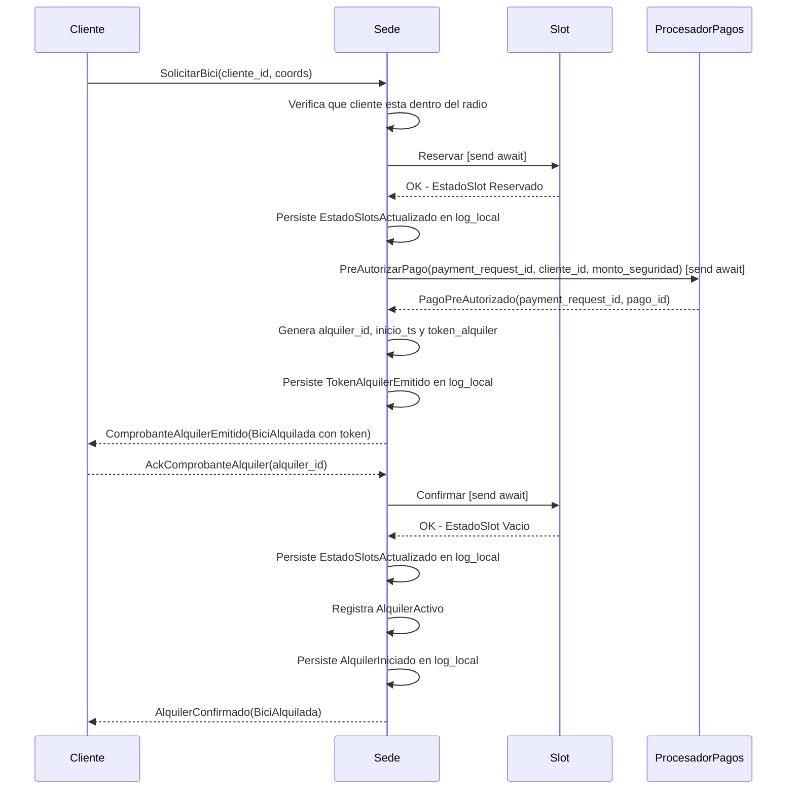
```mermaid
sequenceDiagram
    participant Cliente
    participant Sede
    participant Slot
    participant ProcesadorPagos

    Cliente->>Sede: SolicitarBici(cliente_id, coords)
    Sede->>Sede: Verifica que cliente esta dentro del radio
    Sede->>Slot: Reservar [send await]
    Slot-->>Sede: OK - EstadoSlot Reservado
    Sede->>Sede: Persiste EstadoSlotsActualizado en log_local

    Sede->>ProcesadorPagos: PreAutorizarPago(payment_request_id, cliente_id, monto_seguridad) [send await]
    ProcesadorPagos-->>Sede: PagoPreAutorizado(payment_request_id, pago_id)

    Sede->>Sede: Genera alquiler_id, inicio_ts y token_alquiler
    Sede->>Sede: Persiste TokenAlquilerEmitido en log_local
    Sede-->>Cliente: ComprobanteAlquilerEmitido(BiciAlquilada con token)
    Cliente-->>Sede: AckComprobanteAlquiler(alquiler_id)

    Sede->>Slot: Confirmar [send await]
    Slot-->>Sede: OK - EstadoSlot Vacio
    Sede->>Sede: Persiste EstadoSlotsActualizado en log_local
    Sede->>Sede: Registra AlquilerActivo
    Sede->>Sede: Persiste AlquilerIniciado en log_local
    Sede-->>Cliente: AlquilerConfirmado(BiciAlquilada)
```

---

### 2. Alquiler rechazado — cliente fuera del radio

El cliente intenta alquilar una bici pero sus coordenadas están fuera del rango permitido por la sede. La Sede rechaza sin llegar a consultar los slots.

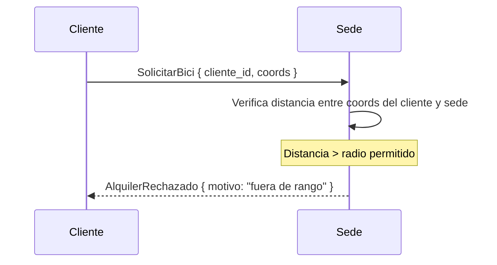
```mermaid
sequenceDiagram
    participant Cliente
    participant Sede

    Cliente->>Sede: SolicitarBici { cliente_id, coords }
    Sede->>Sede: Verifica distancia entre coords del cliente y sede
    Note over Sede: Distancia > radio permitido
    Sede-->>Cliente: AlquilerRechazado { motivo: "fuera de rango" }
```

---

### 3. Alquiler rechazado — sede sin disponibilidad

El cliente está dentro del radio pero la sede no tiene ningún slot en estado `Disponible`. La Sede rechaza antes de iniciar la saga.

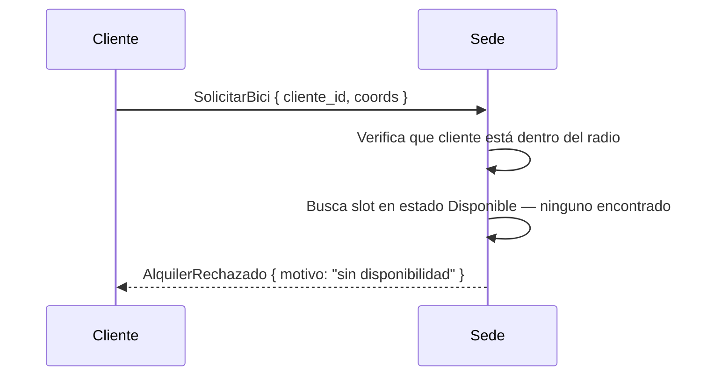
```mermaid
sequenceDiagram
    participant Cliente
    participant Sede

    Cliente->>Sede: SolicitarBici { cliente_id, coords }
    Sede->>Sede: Verifica que cliente está dentro del radio
    Sede->>Sede: Busca slot en estado Disponible — ninguno encontrado
    Sede-->>Cliente: AlquilerRechazado { motivo: "sin disponibilidad" }
```

---

### 4. Devolución rechazada — sede sin slots vacíos

El cliente intenta devolver la bicicleta pero la sede no tiene ningún slot en estado `Vacio` para recibirla. El cliente debe buscar otra sede con lugar disponible.

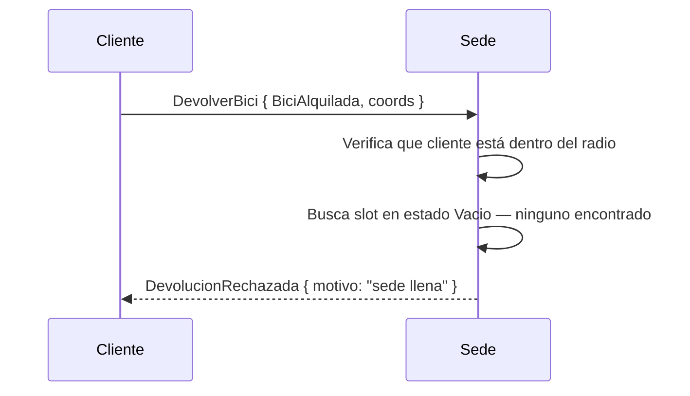
```mermaid
sequenceDiagram
    participant Cliente
    participant Sede

    Cliente->>Sede: DevolverBici { BiciAlquilada, coords }
    Sede->>Sede: Verifica que cliente está dentro del radio
    Sede->>Sede: Busca slot en estado Vacio — ninguno encontrado
    Sede-->>Cliente: DevolucionRechazada { motivo: "sede llena" }
```

---

### 5. Saga con rollback — pago rechazado

El slot es reservado exitosamente pero la pre-autorización del pago falla. La Sede ejecuta la compensación correspondiente: cancela la reserva del slot para dejarlo disponible nuevamente.

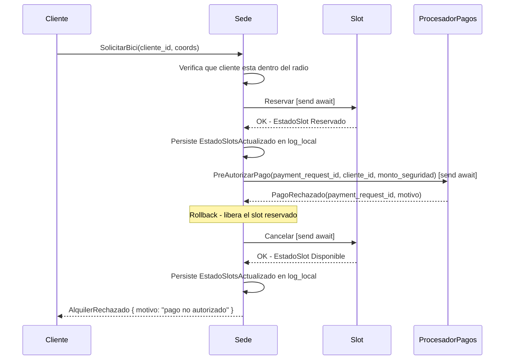
```mermaid
sequenceDiagram
    participant Cliente
    participant Sede
    participant Slot
    participant ProcesadorPagos

    Cliente->>Sede: SolicitarBici(cliente_id, coords)
    Sede->>Sede: Verifica que cliente esta dentro del radio
    Sede->>Slot: Reservar [send await]
    Slot-->>Sede: OK - EstadoSlot Reservado
    Sede->>Sede: Persiste EstadoSlotsActualizado en log_local
    Sede->>ProcesadorPagos: PreAutorizarPago(payment_request_id, cliente_id, monto_seguridad) [send await]
    ProcesadorPagos-->>Sede: PagoRechazado(payment_request_id, motivo)
    Note over Sede: Rollback - libera el slot reservado
    Sede->>Slot: Cancelar [send await]
    Slot-->>Sede: OK - EstadoSlot Disponible
    Sede->>Sede: Persiste EstadoSlotsActualizado en log_local
    Sede-->>Cliente: AlquilerRechazado { motivo: "pago no autorizado" }
```

---
 
### 6. Dos clientes compiten por el último slot disponible

Este caso ilustra cómo el modelo de actores previene condiciones de carrera. La Sede procesa los mensajes de a uno, por lo que el segundo cliente recibe rechazo sin necesidad de locks explícitos.

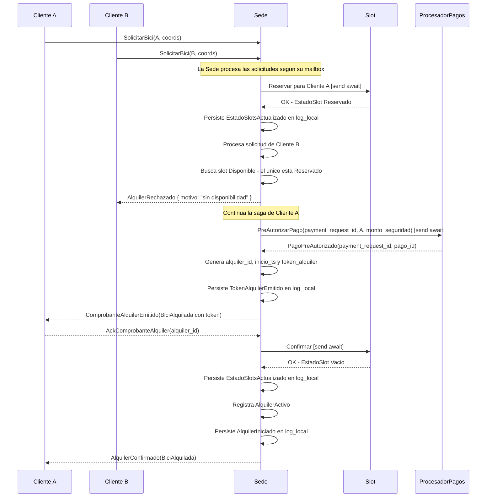
```mermaid
sequenceDiagram
    participant ClienteA as Cliente A
    participant ClienteB as Cliente B
    participant Sede
    participant Slot
    participant ProcesadorPagos

    ClienteA->>Sede: SolicitarBici(A, coords)
    ClienteB->>Sede: SolicitarBici(B, coords)

    Note over Sede: La Sede procesa las solicitudes segun su mailbox
    Sede->>Slot: Reservar para Cliente A [send await]
    Slot-->>Sede: OK - EstadoSlot Reservado
    Sede->>Sede: Persiste EstadoSlotsActualizado en log_local

    Sede->>Sede: Procesa solicitud de Cliente B
    Sede->>Sede: Busca slot Disponible - el unico esta Reservado
    Sede-->>ClienteB: AlquilerRechazado { motivo: "sin disponibilidad" }

    Note over Sede: Continua la saga de Cliente A
    Sede->>ProcesadorPagos: PreAutorizarPago(payment_request_id, A, monto_seguridad) [send await]
    ProcesadorPagos-->>Sede: PagoPreAutorizado(payment_request_id, pago_id)

    Sede->>Sede: Genera alquiler_id, inicio_ts y token_alquiler
    Sede->>Sede: Persiste TokenAlquilerEmitido en log_local
    Sede-->>ClienteA: ComprobanteAlquilerEmitido(BiciAlquilada con token)
    ClienteA-->>Sede: AckComprobanteAlquiler(alquiler_id)

    Sede->>Slot: Confirmar [send await]
    Slot-->>Sede: OK - EstadoSlot Vacio
    Sede->>Sede: Persiste EstadoSlotsActualizado en log_local
    Sede->>Sede: Registra AlquilerActivo
    Sede->>Sede: Persiste AlquilerIniciado en log_local
    Sede-->>ClienteA: AlquilerConfirmado(BiciAlquilada)
```

---

### 7. Devolución con sede desconectada

La sede perdió conectividad con el resto del sistema pero sigue operando localmente. Acepta la devolución si el `token_alquiler` es válido, asegura la bicicleta y deja pendientes las conciliaciones que no pueda completar en el momento.

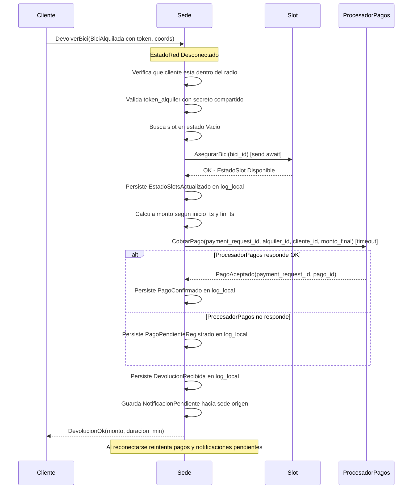
```mermaid
sequenceDiagram
    participant Cliente
    participant Sede
    participant Slot
    participant ProcesadorPagos

    Cliente->>Sede: DevolverBici(BiciAlquilada con token, coords)
    Note over Sede: EstadoRed Desconectado
    Sede->>Sede: Verifica que cliente esta dentro del radio
    Sede->>Sede: Valida token_alquiler con secreto compartido
    Sede->>Sede: Busca slot en estado Vacio
    Sede->>Slot: AsegurarBici(bici_id) [send await]
    Slot-->>Sede: OK - EstadoSlot Disponible
    Sede->>Sede: Persiste EstadoSlotsActualizado en log_local
    Sede->>Sede: Calcula monto segun inicio_ts y fin_ts
    Sede->>ProcesadorPagos: CobrarPago(payment_request_id, alquiler_id, cliente_id, monto_final) [timeout]

    alt ProcesadorPagos responde OK
        ProcesadorPagos-->>Sede: PagoAceptado(payment_request_id, pago_id)
        Sede->>Sede: Persiste PagoConfirmado en log_local
    else ProcesadorPagos no responde
        Sede->>Sede: Persiste PagoPendienteRegistrado en log_local
    end

    Sede->>Sede: Persiste DevolucionRecibida en log_local
    Sede->>Sede: Guarda NotificacionPendiente hacia sede origen
    Sede-->>Cliente: DevolucionOk(monto, duracion_min)
    Note over Sede: Al reconectarse reintenta pagos y notificaciones pendientes
```

---

### 8. Cliente solicita sedes sin conectividad — fallback a caché

El cliente no puede contactar ninguna sede. Usa su caché local para mostrar la última información disponible, indicando que puede estar desactualizada.

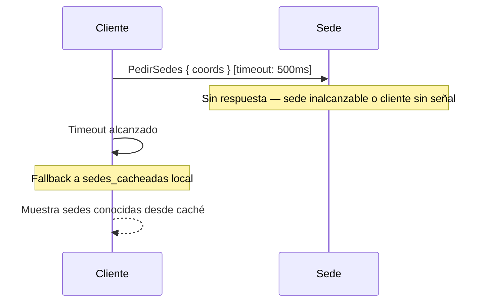
```mermaid
sequenceDiagram
    participant Cliente
    participant Sede

    Cliente->>Sede: PedirSedes { coords } [timeout: 500ms]
    Note over Sede: Sin respuesta — sede inalcanzable o cliente sin señal
    Cliente->>Cliente: Timeout alcanzado
    Note over Cliente: Fallback a sedes_cacheadas local
    Cliente-->>Cliente: Muestra sedes conocidas desde caché
```

---

### 9. Devolución en sede distinta — pago y notificación exitosos

El cliente devuelve una bicicleta en una sede distinta a la que originó el alquiler. La Sede destino valida el comprobante firmado, asegura la bicicleta, cobra el monto correspondiente y notifica a la Sede origen para que cierre el alquiler activo.

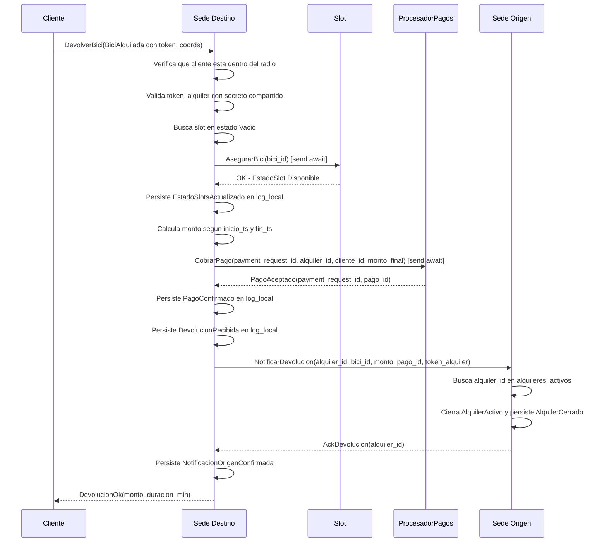
```mermaid
sequenceDiagram
    participant Cliente
    participant SedeDestino as Sede Destino
    participant Slot
    participant ProcesadorPagos
    participant SedeOrigen as Sede Origen

    Cliente->>SedeDestino: DevolverBici(BiciAlquilada con token, coords)
    SedeDestino->>SedeDestino: Verifica que cliente esta dentro del radio
    SedeDestino->>SedeDestino: Valida token_alquiler con secreto compartido
    SedeDestino->>SedeDestino: Busca slot en estado Vacio
    SedeDestino->>Slot: AsegurarBici(bici_id) [send await]
    Slot-->>SedeDestino: OK - EstadoSlot Disponible
    SedeDestino->>SedeDestino: Persiste EstadoSlotsActualizado en log_local
    SedeDestino->>SedeDestino: Calcula monto segun inicio_ts y fin_ts
    SedeDestino->>ProcesadorPagos: CobrarPago(payment_request_id, alquiler_id, cliente_id, monto_final) [send await]
    ProcesadorPagos-->>SedeDestino: PagoAceptado(payment_request_id, pago_id)
    SedeDestino->>SedeDestino: Persiste PagoConfirmado en log_local
    SedeDestino->>SedeDestino: Persiste DevolucionRecibida en log_local
    SedeDestino->>SedeOrigen: NotificarDevolucion(alquiler_id, bici_id, monto, pago_id, token_alquiler)
    SedeOrigen->>SedeOrigen: Busca alquiler_id en alquileres_activos
    SedeOrigen->>SedeOrigen: Cierra AlquilerActivo y persiste AlquilerCerrado
    SedeOrigen-->>SedeDestino: AckDevolucion(alquiler_id)
    SedeDestino->>SedeDestino: Persiste NotificacionOrigenConfirmada
    SedeDestino-->>Cliente: DevolucionOk(monto, duracion_min)
```

---

### 10. Devolución en sede distinta — sede origen no disponible

La Sede destino puede recibir la bicicleta aunque la Sede origen no esté disponible en ese momento. Para aceptar la devolución, primero valida el `token_alquiler`. Luego persiste la devolución y deja pendiente la notificación para reintentar más adelante.

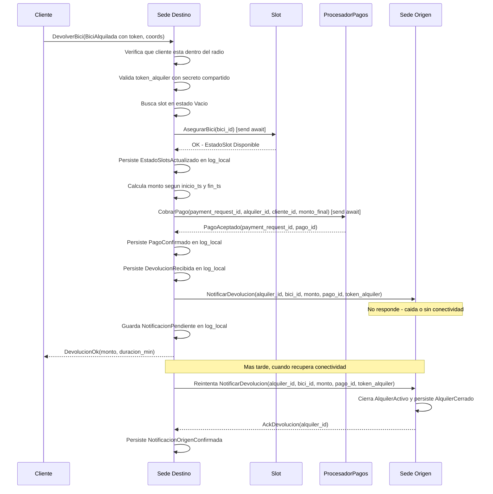
```mermaid
sequenceDiagram
    participant Cliente
    participant SedeDestino as Sede Destino
    participant Slot
    participant ProcesadorPagos
    participant SedeOrigen as Sede Origen

    Cliente->>SedeDestino: DevolverBici(BiciAlquilada con token, coords)
    SedeDestino->>SedeDestino: Verifica que cliente esta dentro del radio
    SedeDestino->>SedeDestino: Valida token_alquiler con secreto compartido
    SedeDestino->>SedeDestino: Busca slot en estado Vacio
    SedeDestino->>Slot: AsegurarBici(bici_id) [send await]
    Slot-->>SedeDestino: OK - EstadoSlot Disponible
    SedeDestino->>SedeDestino: Persiste EstadoSlotsActualizado en log_local
    SedeDestino->>SedeDestino: Calcula monto segun inicio_ts y fin_ts
    SedeDestino->>ProcesadorPagos: CobrarPago(payment_request_id, alquiler_id, cliente_id, monto_final) [send await]
    ProcesadorPagos-->>SedeDestino: PagoAceptado(payment_request_id, pago_id)
    SedeDestino->>SedeDestino: Persiste PagoConfirmado en log_local
    SedeDestino->>SedeDestino: Persiste DevolucionRecibida en log_local
    SedeDestino->>SedeOrigen: NotificarDevolucion(alquiler_id, bici_id, monto, pago_id, token_alquiler)
    Note over SedeOrigen: No responde - caida o sin conectividad
    SedeDestino->>SedeDestino: Guarda NotificacionPendiente en log_local
    SedeDestino-->>Cliente: DevolucionOk(monto, duracion_min)

    Note over SedeDestino,SedeOrigen: Mas tarde, cuando recupera conectividad
    SedeDestino->>SedeOrigen: Reintenta NotificarDevolucion(alquiler_id, bici_id, monto, pago_id, token_alquiler)
    SedeOrigen->>SedeOrigen: Cierra AlquilerActivo y persiste AlquilerCerrado
    SedeOrigen-->>SedeDestino: AckDevolucion(alquiler_id)
    SedeDestino->>SedeDestino: Persiste NotificacionOrigenConfirmada
```

---

### 11. Devolución con pago pendiente — caída de ProcesadorPagos

La Sede destino puede recibir físicamente la bicicleta aunque no logre confirmar el cobro en ese momento. Primero valida el `token_alquiler`; si los nodos `ProcesadorPagos` no responden, persiste un `PagoPendiente` en su `log_local` y reintenta más adelante usando el mismo `payment_request_id`.

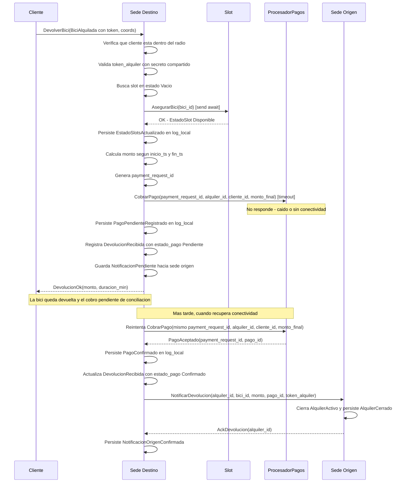
```mermaid
sequenceDiagram
    participant Cliente
    participant SedeDestino as Sede Destino
    participant Slot
    participant ProcesadorPagos
    participant SedeOrigen as Sede Origen

    Cliente->>SedeDestino: DevolverBici(BiciAlquilada con token, coords)
    SedeDestino->>SedeDestino: Verifica que cliente esta dentro del radio
    SedeDestino->>SedeDestino: Valida token_alquiler con secreto compartido
    SedeDestino->>SedeDestino: Busca slot en estado Vacio
    SedeDestino->>Slot: AsegurarBici(bici_id) [send await]
    Slot-->>SedeDestino: OK - EstadoSlot Disponible
    SedeDestino->>SedeDestino: Persiste EstadoSlotsActualizado en log_local
    SedeDestino->>SedeDestino: Calcula monto segun inicio_ts y fin_ts
    SedeDestino->>SedeDestino: Genera payment_request_id
    SedeDestino->>ProcesadorPagos: CobrarPago(payment_request_id, alquiler_id, cliente_id, monto_final) [timeout]
    Note over ProcesadorPagos: No responde - caido o sin conectividad
    SedeDestino->>SedeDestino: Persiste PagoPendienteRegistrado en log_local
    SedeDestino->>SedeDestino: Registra DevolucionRecibida con estado_pago Pendiente
    SedeDestino->>SedeDestino: Guarda NotificacionPendiente hacia sede origen
    SedeDestino-->>Cliente: DevolucionOk(monto, duracion_min)
    Note over Cliente,SedeDestino: La bici queda devuelta y el cobro pendiente de conciliacion

    Note over SedeDestino,ProcesadorPagos: Mas tarde, cuando recupera conectividad
    SedeDestino->>ProcesadorPagos: Reintenta CobrarPago(mismo payment_request_id, alquiler_id, cliente_id, monto_final)
    ProcesadorPagos-->>SedeDestino: PagoAceptado(payment_request_id, pago_id)
    SedeDestino->>SedeDestino: Persiste PagoConfirmado en log_local
    SedeDestino->>SedeDestino: Actualiza DevolucionRecibida con estado_pago Confirmado

    SedeDestino->>SedeOrigen: NotificarDevolucion(alquiler_id, bici_id, monto, pago_id, token_alquiler)
    SedeOrigen->>SedeOrigen: Cierra AlquilerActivo y persiste AlquilerCerrado
    SedeOrigen-->>SedeDestino: AckDevolucion(alquiler_id)
    SedeDestino->>SedeDestino: Persiste NotificacionOrigenConfirmada
```

---

### 12. Sede origen no recibe la notificación a tiempo — robo confirmado y multa

La Sede origen tiene un alquiler activo que superó el tiempo máximo esperado. Como no recibió `NotificarDevolucion` dentro del plazo, no consulta al resto de las sedes. Directamente marca el alquiler como robo confirmado y cobra una penalización al cliente.

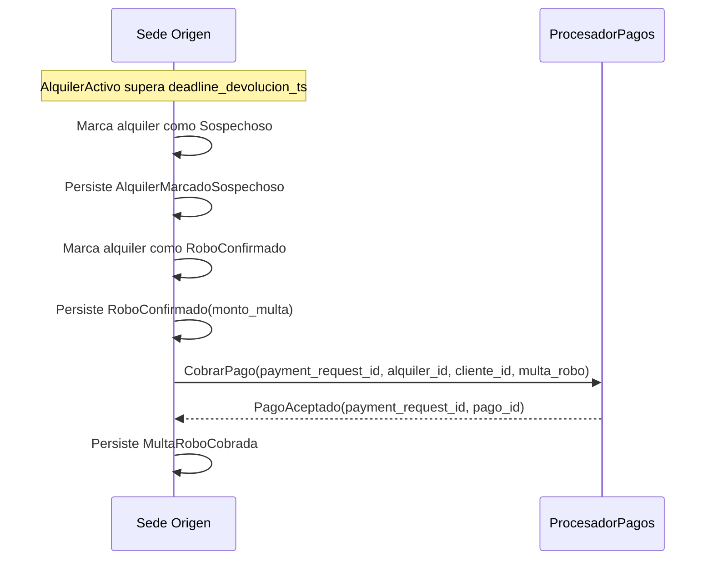
```mermaid
sequenceDiagram
    participant SedeOrigen as Sede Origen
    participant ProcesadorPagos

    Note over SedeOrigen: AlquilerActivo supera deadline_devolucion_ts
    SedeOrigen->>SedeOrigen: Marca alquiler como Sospechoso
    SedeOrigen->>SedeOrigen: Persiste AlquilerMarcadoSospechoso
    SedeOrigen->>SedeOrigen: Marca alquiler como RoboConfirmado
    SedeOrigen->>SedeOrigen: Persiste RoboConfirmado(monto_multa)
    SedeOrigen->>ProcesadorPagos: CobrarPago(payment_request_id, alquiler_id, cliente_id, multa_robo)
    ProcesadorPagos-->>SedeOrigen: PagoAceptado(payment_request_id, pago_id)
    SedeOrigen->>SedeOrigen: Persiste MultaRoboCobrada
```

---

### 13. Notificación tardía — la bici no fue robada y se reembolsa la penalización

La Sede destino había recibido la bicicleta, pero no logró avisarle a la Sede origen antes del timeout. Cuando finalmente llega la notificación, la Sede origen valida el token, revierte el robo y solicita el reembolso de la multa cobrada.

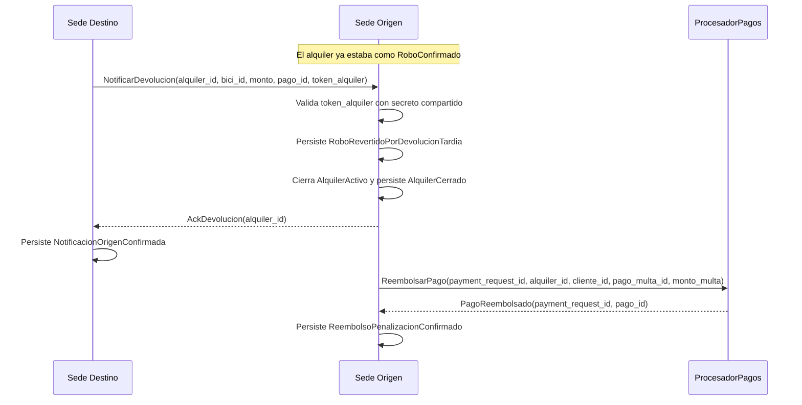
```mermaid
sequenceDiagram
    participant SedeDestino as Sede Destino
    participant SedeOrigen as Sede Origen
    participant ProcesadorPagos

    Note over SedeOrigen: El alquiler ya estaba como RoboConfirmado
    SedeDestino->>SedeOrigen: NotificarDevolucion(alquiler_id, bici_id, monto, pago_id, token_alquiler)
    SedeOrigen->>SedeOrigen: Valida token_alquiler con secreto compartido
    SedeOrigen->>SedeOrigen: Persiste RoboRevertidoPorDevolucionTardia
    SedeOrigen->>SedeOrigen: Cierra AlquilerActivo y persiste AlquilerCerrado
    SedeOrigen-->>SedeDestino: AckDevolucion(alquiler_id)
    SedeDestino->>SedeDestino: Persiste NotificacionOrigenConfirmada
    SedeOrigen->>ProcesadorPagos: ReembolsarPago(payment_request_id, alquiler_id, cliente_id, pago_multa_id, monto_multa)
    ProcesadorPagos-->>SedeOrigen: PagoReembolsado(payment_request_id, pago_id)
    SedeOrigen->>SedeOrigen: Persiste ReembolsoPenalizacionConfirmado
```

---

### 14. Alquiler con caída entre liberar la bicicleta y registrar el alquiler

Este caso cubre el borde donde la Sede origen libera físicamente la bicicleta pero se cae antes de persistir `AlquilerIniciado`. La devolución sigue siendo posible porque el Cliente ya recibió una `BiciAlquilada` con `token_alquiler`.

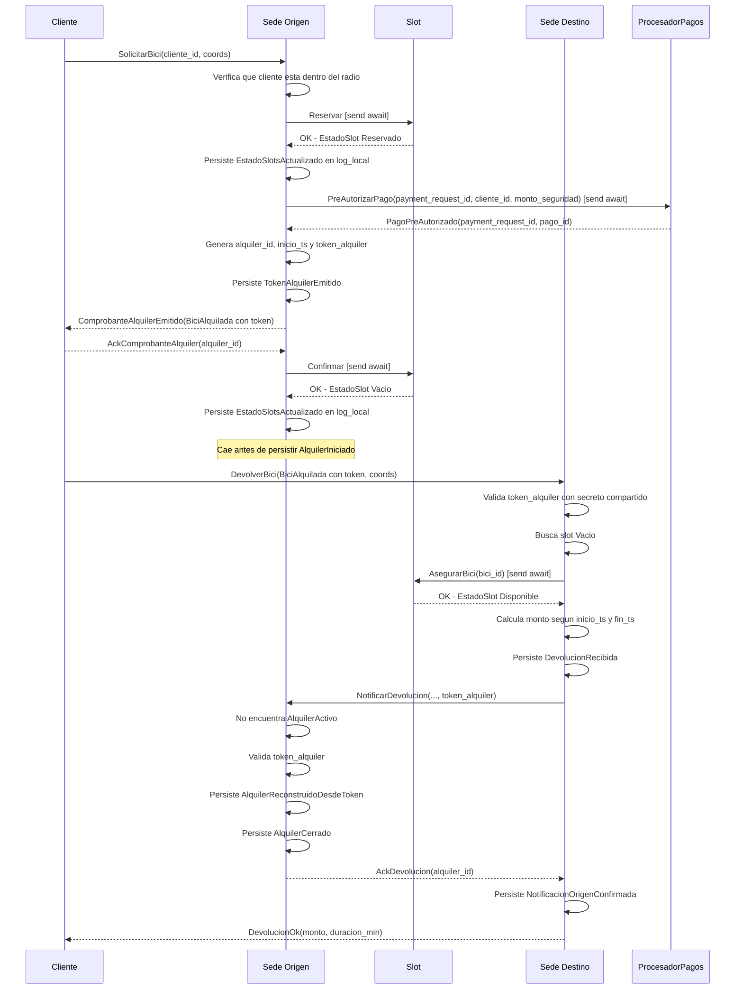
```mermaid
sequenceDiagram
    participant Cliente
    participant SedeOrigen as Sede Origen
    participant Slot
    participant SedeDestino as Sede Destino
    participant ProcesadorPagos

    Cliente->>SedeOrigen: SolicitarBici(cliente_id, coords)
    SedeOrigen->>SedeOrigen: Verifica que cliente esta dentro del radio
    SedeOrigen->>Slot: Reservar [send await]
    Slot-->>SedeOrigen: OK - EstadoSlot Reservado
    SedeOrigen->>SedeOrigen: Persiste EstadoSlotsActualizado en log_local

    SedeOrigen->>ProcesadorPagos: PreAutorizarPago(payment_request_id, cliente_id, monto_seguridad) [send await]
    ProcesadorPagos-->>SedeOrigen: PagoPreAutorizado(payment_request_id, pago_id)

    SedeOrigen->>SedeOrigen: Genera alquiler_id, inicio_ts y token_alquiler
    SedeOrigen->>SedeOrigen: Persiste TokenAlquilerEmitido
    SedeOrigen-->>Cliente: ComprobanteAlquilerEmitido(BiciAlquilada con token)
    Cliente-->>SedeOrigen: AckComprobanteAlquiler(alquiler_id)

    SedeOrigen->>Slot: Confirmar [send await]
    Slot-->>SedeOrigen: OK - EstadoSlot Vacio
    SedeOrigen->>SedeOrigen: Persiste EstadoSlotsActualizado en log_local

    Note over SedeOrigen: Cae antes de persistir AlquilerIniciado

    Cliente->>SedeDestino: DevolverBici(BiciAlquilada con token, coords)
    SedeDestino->>SedeDestino: Valida token_alquiler con secreto compartido
    SedeDestino->>SedeDestino: Busca slot Vacio
    SedeDestino->>Slot: AsegurarBici(bici_id) [send await]
    Slot-->>SedeDestino: OK - EstadoSlot Disponible
    SedeDestino->>SedeDestino: Calcula monto segun inicio_ts y fin_ts
    SedeDestino->>SedeDestino: Persiste DevolucionRecibida

    SedeDestino->>SedeOrigen: NotificarDevolucion(..., token_alquiler)
    SedeOrigen->>SedeOrigen: No encuentra AlquilerActivo
    SedeOrigen->>SedeOrigen: Valida token_alquiler
    SedeOrigen->>SedeOrigen: Persiste AlquilerReconstruidoDesdeToken
    SedeOrigen->>SedeOrigen: Persiste AlquilerCerrado
    SedeOrigen-->>SedeDestino: AckDevolucion(alquiler_id)
    SedeDestino->>SedeDestino: Persiste NotificacionOrigenConfirmada
    SedeDestino-->>Cliente: DevolucionOk(monto, duracion_min)
```
